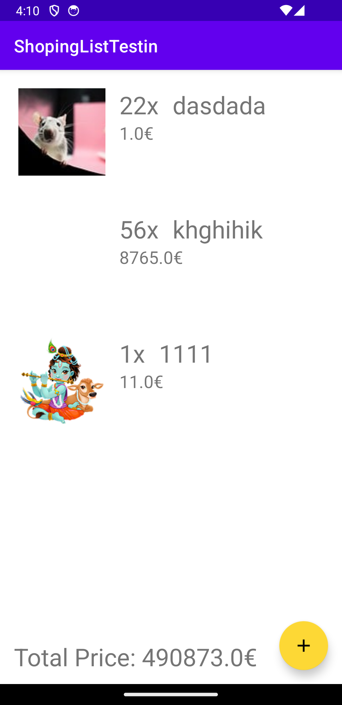

# Shopping-UnitTesting

## Description

Shopping-UnitTesting is a simple Android application for creating a list of shopping items that need to be purchased and storing them in a Room database. It utilizes **Kotlin**, **Navigation UI**, **Coroutines**, **Hilt Dependency Injection**, **MVVM architecture**, **Room Database**, **Unit Testing**, and the **PixaBay API** for fetching images of the items. The main focus of this repository is on demonstrating best practices for unit testing in Android applications.

### Technologies Used:

- **Kotlin**
- **Navigation UI**
- **Coroutines**
- **Hilt Dependency Injection**
- **MVVM**
- **Room Database**
- **Unit Testing**
- **PixaBay API**

Shopping-UnitTesting provides examples of how to effectively write unit tests in an Android application.

## Screenshots

  

## Table of Contents

- [Installation](#installation)
- [Usage](#usage)
- [Contributing](#contributing)
- [License](#license)

## Installation

1. Clone the repository:
git clone https://github.com/rahulgothwal5/Shopping-UnitTesting.git
2. Open the project in Android Studio.

## Usage

Explore the codebase to learn how to write effective unit tests for Android applications. The app demonstrates unit testing practices using **Kotlin**, **Coroutines**, **Hilt Dependency Injection**, **MVVM architecture**, and **Room Database**. Additionally, it showcases the integration of the **PixaBay API** for fetching images of shopping items.

## Contributing

1. Fork the repository.
2. Create a new branch (`git checkout -b feature/your-feature-name`).
3. Make your changes.
4. Commit your changes (`git commit -am 'Add new feature'`).
5. Push to the branch (`git push origin feature/your-feature-name`).
6. Create a new Pull Request.

## License

This project is licensed under the [MIT License](LICENSE).
